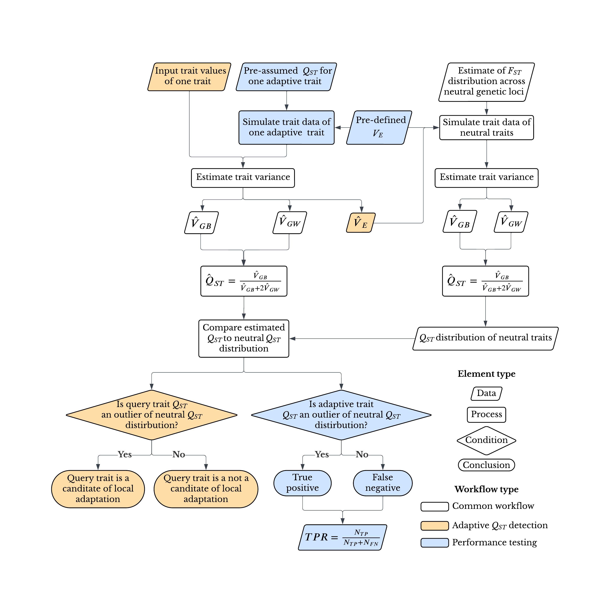

# <span style="color:red">RED</span>QuanTA

**R**eplication-**E**nhanced **D**etection of **Quan**titative **T**raits under **A**daptation

[](https://opensource.org/licenses/MIT)

A workflow for detecting adaptive quantitative trait divergence (Q<sub>ST</sub>) using Approximate Bayesian Computation (ABC). The workflow supports both local execution (via Snakemake) and distributed computing (via HTCondor).

## Workflow Overview



### Module 1: Detect Adaptive Traits
1. Calculate variance components using Method of Moments (MoM)
2. Estimate trait Q<sub>ST</sub> using ABC with neural network regression
3. Generate neutral Q<sub>ST</sub> distribution from empirical F<sub>ST</sub> values
4. Compare trait Q<sub>ST</sub> to the neutral threshold (95th percentile)
5. Flag traits as adaptive if Q<sub>ST</sub> > threshold

### Module 2: Evaluate Performance
1. Simulate traits with known adaptive Q<sub>ST</sub> values
2. Calculate True Positive Rate (TPR) and False Positive Rate (FPR)
3. Rank summary statistic combinations by performance
4. Compare power across different sample structures

## Installation

```bash
# Clone the repository
git clone https://github.com/yourusername/REDQuanTA.git
cd REDQuanTA

# Create conda environment
conda env create -f environment.yml
conda activate redquanta
```

## Quick Start

### Module 1: Detect Adaptive Traits (Local/Snakemake)

```bash
# Dry run to see what will be executed
snakemake --configfile config/config_detect.yaml --cores 4 -n

# Run the workflow
snakemake --configfile config/config_detect.yaml --cores 4
```

### Module 2: Evaluate Performance (Local/Snakemake)

```bash
# With reduced parameters for local testing
snakemake --configfile config/config_evaluate.yaml --cores 4

# Output: results/evaluate/combined_model_ranking.csv
```

### HTCondor Execution

For large-scale analysis using HTCondor distributed computing:

```bash
# Module 1: Generate and submit DAG
python htcondor/scripts/prepare_trait_dag.py --trait-id L0MQ04
condor_submit_dag results/dags/trait_L0MQ04.dag

# Module 2: Generate and submit evaluation DAG
python htcondor/scripts/prepare_perf_eval_dag.py --chr both
condor_submit_dag results/perf_eval/perf_eval_autosomes.dag
```

## Input Files

| File | Description |
|------|-------------|
| `sample_structure.csv` | Population/strain/replicate structure |
| `trait_values.csv` | Trait measurements per strain/replicate |
| `qst_neutral_autosomes.txt` | Neutral F<sub>ST</sub> values (autosomes) |
| `qst_neutral_chrX.txt` | Neutral F<sub>ST</sub> values (X chromosome) |

### Sample Structure Format

```csv
population,strain,replicate
pop1,strain1,rep1
pop1,strain1,rep2
pop1,strain2,rep1
...
```

### Trait Values Format

```csv
trait_id,chr,population,strain,replicate,value
trait001,autosomes,pop1,strain1,rep1,0.523
trait001,autosomes,pop1,strain1,rep2,0.541
...
```

## Output Files

| File | Description |
|------|-------------|
| `qst_results.csv` | Detection results (trait_id, chr, QST, adaptive) |
| `tpr_fpr_matrix_*.csv` | TPR/FPR matrices per chromosome |
| `combined_model_ranking.csv` | Model performance ranking |

## Directory Structure

```
REDQuanTA/
├── README.md                    # This file
├── README_details.md            # Detailed documentation
├── environment.yml              # Conda environment
├── Dockerfile                   # Validation container
├── config/                      # Snakemake configuration
│   ├── config_detect.yaml       # Module 1 config
│   ├── config_evaluate.yaml     # Module 2 (local, reduced params)
│   └── config_evaluate_full.yaml# Module 2 (HTCondor, full params)
├── workflow/                    # Snakemake workflow
│   ├── Snakefile
│   ├── rules/
│   └── scripts/
├── htcondor/                    # HTCondor execution
│   ├── scripts/
│   └── env/
├── data/
│   ├── example/                 # Example input data
│   └── reference/               # Reference figures
└── results/                     # Output directory
```

## Documentation

- **[README_details.md](README_details.md)**: Full parameter documentation, HTCondor setup, troubleshooting
- **[HTCondor Documentation](https://htcondor.readthedocs.io/)**: Official HTCondor docs

## Citation

If you use REDQuanTA in your research, please cite:

> Feng, S., & Pool, J. E. (in preparation). *REDQuanTA: Replication-Enhanced Detection of Quantitative Traits under Adaptation — an improved statistical framework to detect locally adaptive traits*. Laboratory of Genetics, University of Wisconsin-Madison.

Until the paper is published, you may also cite this repository directly:

> Feng, S., & Pool, J. E. (2025). *REDQuanTA* [Software]. GitHub. https://github.com/sfeng666/REDQuanTA

## License

This project is licensed under the MIT License - see the LICENSE file for details.
